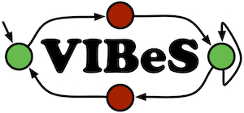

# VIBeS (Forked Version)

This project is a **fork of [VIBeS](https://github.com/xdevroey/vibes/)**, originally developed by Xavier Devroey at the University of Namur.

Modifications have been made in 2025 by Sophie Fortz, under the terms of the **Apache License 2.0**.
See the [`LICENSE`](LICENSE) and [`NOTICE`](NOTICE) files for details.

---

## Original Project Summary

> *The following is retained from the original README.*

This project aims at providing a framework to perform behavioural testing of SPLs.

### Project structure

Structure separates the framework modules from the different executables jars created using those modules.

* vibes: The root project with the website content
	* vibes-core: The models definition core lib
	* vibes-execution, vibes-mutation, ... : The different modules defined to perform various testing activities
	* vibes-dsl: The dsl definition to simply use the different modules (each library has its dsl classes defined in a separate package)
	* vibes-toolbox: The module containing all executable jars built using the framework. Each executable jar is defined as a sub-module. Executables MUST be defined as vibes-toolbox SUB-MODULES.

---

## Overview of Changes

The fork introduces **significant architectural changes** to support integration with modern variability model standards, notably **UVL (Universal Variability Language)**.

### ✨ Goals of the Modifications

* Improve modularity and clarity of the architecture.
* Align the feature model representation with the UVL standard for better interoperability.
* Facilitate import/export of feature models from/to standardized formats.

### 🔧 Major Structural Updates

* **Separation of concerns** between `SolverFacade` and `FeatureModel`.
* Introduction of **hierarchical feature models** with explicit parent-child relationships.
* Addition of a `Group` structure for organizing children under grouped constraints (e.g., OR, XOR).
* Still limited to **Boolean feature models**, no numeric or string attributes yet.

---

## Solver Compatibility

At this stage, only **JavaBDD** is supported as a backend solver.

> ⚠️ **SAT4J is not currently compatible** due to changes in feature model structure for UVL compliance.

Although SAT solvers and BDD-based solvers are logically equivalent in many reasoning tasks, **Binary Decision Diagrams (BDDs)** often offer superior performance for configuration and consistency checks.

Recent research shows growing success in **scalable compilation of BDDs from feature models**, making them increasingly practical.

**📚 Relevant references**:

* Sundermann et al., *Efficient Slicing of Feature Models via Projected d-DNNF Compilation* \[ASE 2024]
* Dubslaff et al., *Configuring BDD Compilation Techniques for Feature Models* \[SPLC 2024]
* Heß et al., *Towards Deterministic Compilation of Binary Decision Diagrams From Feature Models* \[SPLC 2024]

---

## License

This fork is licensed under the **Apache License, Version 2.0**.
Some files may retain different licenses or include external dependencies.
See each module’s `LICENSE` and `NOTICE` files for full details.

---
